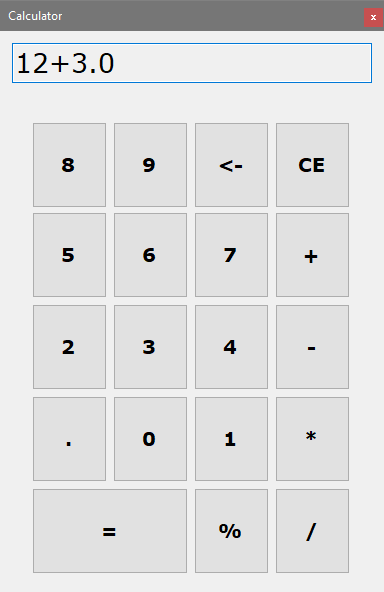

# Calculator-Winforms
A basic calculator I made using Winforms and C#. I wanted to see how fast I could make a calculator app using .NET/C#.
The basic functionality was done in half in hour, and the keyboard functionality and refactor was done in roughly an hour altogether.

---

Please note that this was made using .NET Framework 5.0, which is no longer supported by Microsoft.
